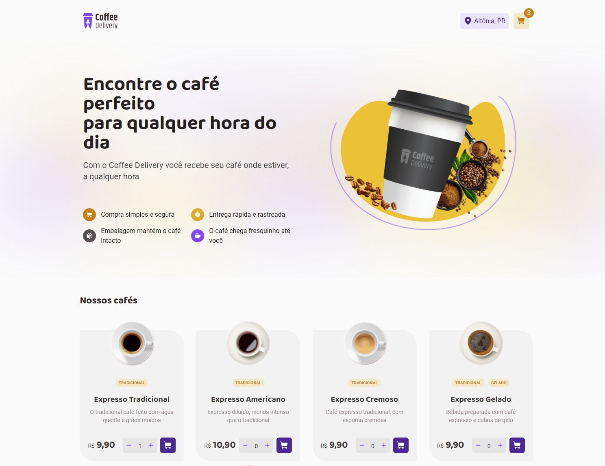
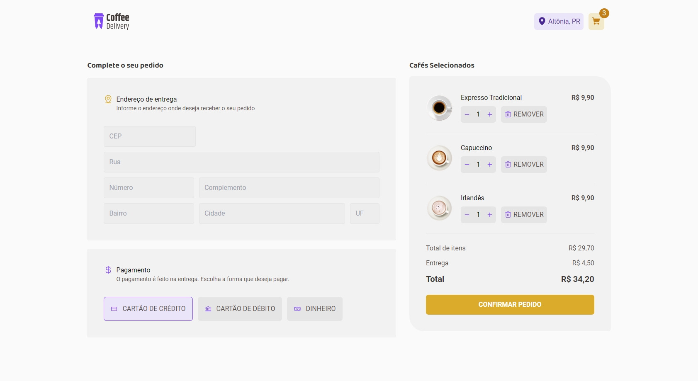

# Coffee Delivery

Exemplo de página de pedidos criado em React

> #### Ferramentas utilizadas:
>
> - Tailwindcss
> - Phosphor Icons
> - localStorage
> - Context Api
> - React Router Dom
> - React Hook Form
> - Zod

